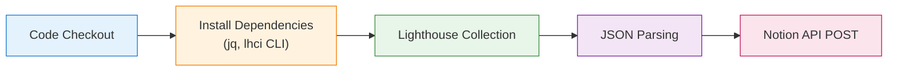

# CDN 도입으로 개선된 성능 보고서

## 목차
- [CDN 도입으로 개선된 성능 보고서](#cdn-도입으로-개선된-성능-보고서)
  - [목차](#목차)
  - [주요 링크](#주요-링크)
  - [주요 개념 정리](#주요-개념-정리)
  - [S3](#s3)
    - [사용 이유](#사용-이유)
    - [Next를 정적으로 내보내는 이유](#next를-정적으로-내보내는-이유)
  - [CloudFront](#cloudfront)
    - [사용 이유: S3 단독 사용의 한계](#사용-이유-s3-단독-사용의-한계)
    - [CloudFront의 역할](#cloudfront의-역할)
    - [캐시 무효화](#캐시-무효화)
  - [웹 성능](#웹-성능)
    - [성능 측정시 확인해야 할 내용](#성능-측정시-확인해야-할-내용)
    - [웹 성능 확인 툴](#웹-성능-확인-툴)
  - [S3 vs CloudFront 성능 비교](#s3-vs-cloudfront-성능-비교)
  - [GitHub Actions를 통한 배포 자동화](#github-actions를-통한-배포-자동화)
  - [GitHub Actions를 통한 Notion 성능 측정 보고서 자동화](#github-actions를-통한-notion-성능-측정-보고서-자동화)
    - [구현 방법](#구현-방법)
    - [오류 해결 경험](#오류-해결-경험)


## 주요 링크
- S3 버킷 웹사이트 엔드포인트: http://hanghae-front-4-1.s3-website-ap-southeast-2.amazonaws.com/
- CloudFrount 배포 도메인 이름:https://d1b5m8lrjvovnk.cloudfront.net/


## 주요 개념 정리
  - GitHub Actions과 CI/CD 도구
    - GitHub 저장소에서 자동으로 빌드, 테스트, 배포 등 반복 작업을 실행할 수 있게 해주는 자동화 도구
    - CI(Continuous Integration)는 개발 중 코드 변경을 자동으로 빌드·테스트하는 과정이고, CD(Continuous Deployment/Delivery)는 빌드된 결과물을 자동으로 배포하는 과정
  - S3와 스토리지
    - AWS의 객체 스토리지 서비스로, 정적 파일(이미지, HTML, CSS, JS 등)을 저장하고 인터넷을 통해 접근 가능하게 하는 저장 공간. 서버리스 형태로 용량 걱정 없이 데이터를 저장할 수 있음
  - CloudFront와 CDN
    - AWS의 CDN(Content Delivery Network) 서비스로, 전 세계 여러 엣지 서버에 콘텐츠를 캐시해 사용자에게 지리적으로 가까운 서버에서 빠르게 전달함으로써 웹사이트 속도를 개선하고 트래픽 부하를 분산시킴
  - 캐시 무효화(Cache Invalidation)
    - CDN이나 브라우저에 저장된 오래된 캐시 데이터를 강제로 삭제 또는 갱신하게 하여, 최신 콘텐츠가 사용자에게 전달되도록 만드는 작업
  - Repository secret과 환경변수
    - GitHub 저장소에 민감한 정보(예: AWS 키, API 토큰)를 안전하게 저장하는 기능. 워크플로우에서 이 값을 환경변수로 불러와 코드에 직접 노출하지 않고 사용 가능하도록 함


## S3
###  사용 이유
  - 객체 스토리지 서비스로, 정적 리소스(HTML, JS, CSS, 이미지 등)를 호스팅하는 데 적합
  - 높은 가용성 
  - 서버 설정 불필요
### Next를 정적으로 내보내는 이유
  - 기본과제에서 ouput을 ‘export’로 설정하였는데, 이는 Next.js로 만들어진 사이트를 정적으로 HTML, CSS, JS로 내보내는 방식
  - 서버 없이 배포 가능: Node.js 서버가 필요 없고, HTML/JS만 있으면 실행됨.
  - 저렴하고 안정적: S3 같은 정적 호스팅에 올리면 운영비용이 거의 없음.
  - 보안상 이점: 서버가 없으므로 서버 해킹 위험이 없음.
  - 빠른 응답 속도: 미리 렌더된 HTML을 제공 → TTFB(Time To First Byte) 최소화
  - SEO에 유리: 정적으로 렌더된 HTML을 검색엔진이 쉽게 읽을 수 있음


## CloudFront

### 사용 이유: S3 단독 사용의 한계
  - S3는 버킷이 있는 지역에 따라 지연(latency)이 발생할 수 있음 (ex: 서울 리전에서 미국 사용자 접속 시 느림)
  - 정적 리소스를 여러 사용자에게 빠르게 전달하려면 전 세계적으로 분산된 캐시 서버(CDN)가 필요함
### CloudFront의 역할
  - CDN 역할: 사용자 위치에 따라 가장 가까운 엣지 로케이션에서 정적 리소스를 제공
  - 보안 강화: S3를 퍼블릭으로 열지 않고도 CloudFront를 통해 안전하게 접근 가능
  - 캐시 기능: 리소스를 캐싱하여 서버 부하 감소 및 속도 향상
  - SSL/TLS 지원: HTTPS 제공으로 보안 강화
### 캐시 무효화
  - **무효화하는 이유**
    - S3에 새 버전의 파일을 업로드 해도, CloudFront는 이전 파일을 계속 캐시해서 사용자는 오래된 내용을 보게 될 수 있음
  - **무효화 하는 방법**
    1. **CloudFront Invalidation API 호출**
        
        ```jsx
        aws cloudfront create-invalidation \
          --distribution-id YOUR_DISTRIBUTION_ID \
          --paths "/*"
        ```
        
        - 단점: 요청당 비용이 있으며 (1,000개 경로 이상부터 과금), 너무 자주 하면 비효율적
    2. **정적 자산에 버전 해시를 붙이는 방법 (캐시 무효화 없이 회피)**
        - 파일 이름을 매번 바꾸는 방식으로, `main.abc123.js`, `style.df98a.css` 처럼 빌드시 해시를 붙이고, HTML에서 새로운 파일 이름으로 참조함
        - 캐시 무효화가 필요 없고, 브라우저/CloudFront가 새 파일로 자동 갱신함
        - Next.js는 정적 자산에 해시를 붙이고 HTML에서도 자동으로 그걸 참조하게 바꿔주기 때문에, 따로 캐시 무효화 신경 안 써도 항상 최신 파일이 로드됨
    3. **Cache-Control 헤더 설정**
        - CloudFront/S3의 응답 헤더에 Cache-Control을 설정해서 캐시 지속시간을 짧게 설정
            
            ```jsx
            Cache-Control: max-age=60, must-revalidate // 60초 후 만료
            // no-cache, no-store → 캐시 자체를 하지 않도록 설정 가능
            ```
            
        - 세밀한 제어가 가능하나, 캐시의 장점이 줄어들 수 있음 (속도 저하)
    4. **CloudFront Behavior 변경**
        - CloudFront 콘솔에서 특정 경로나 파일에 대해 캐시 무효화 전략을 별도로 설정
        - 특정 경로만 `Cache TTL = 0` 설정. 쿠키, 헤더, 쿼리스트링 별로 캐시 분리


## 웹 성능
- 웹 성능 최적화를 위해서는 웹 사이트의 로딩 성능(Loading Performance), 렌더링 성능(Rendering Performance) 등을 개선하는 것에 집중해야 함
  - 로딩 성능: 서버에서 웹 페이지에 필요한 HTML, CSS, Javascript, 미디어 소스(Image, Video) 등의 리소스를 다운로드할 때의 성능
  - 렌더링 성능: 페이지 화면에 주요 리소스가 페이지에 그려질 때의 성능
### 성능 측정시 확인해야 할 내용


**1) LCP (Largest Contentful Paint)**
  - 페이지에서 핵심 요소의 콘텐츠 로딩 속도를 측정
  - 일반적으로 페이지에서 가장 큰 영역으로 해당 영역에 있는 이미지, 영상, 텍스트 부분 등 요소의 렌더링 성능을 기반으로 측정됨
  - 웹 페이지에서 가장 의미 있고 사용자가 접하는 가장 중요한 첫 요소이기 때문에 해당 영역이 늦게 나타나면 페이지 이탈률이 자연스레 늘어날 수 밖에 없고, 그렇기 때문에 Core Web Vital에서도 중요한 지표로 다루고 있음
    - 2017년 Google의 모바일 부문 글로벌 제품 리드인 Daniel An이 말한 Think with Google의 기사에 따르면, 페이지 로딩 시간이 1초에서 3초로 증가하면 페이지 이탈률이 32%로 증가한다고 하고, 1초에서 10초가 되면 무려 페이지 이탈률이 123%나 된다고 함
        
        
        

**2) FID (First Input Delay)**
  - 사용자가 페이지와 처음 상호 작용(링크 클릭이나 버튼 클릭)할 때, 이에 대한 응답으로 브라우저가 이벤트를 처리하기 까지의 시간을 측정
  - FID는 사용자의 모든 입력 반응성을 반영하지 못해 현재는 FID 대신 INP를 중점적으로 확인

**3) INP (Interaction to Next Paint)**
  - 사용자가 페이지를 방문하여 전체 기간동안 발생하는 모든 클릭, 탭, 키보드의 상호작용을 관찰하여 사용자 상호작용에 대한 페이지의 전반적인 응답성을 평가하는 측정지표
  - 이벤트 입력시간 뿐만 아니라 엔드투엔드로 사용자의 시간까지 확인함

**4) CLS (Cumulative Layout Shift)**
  - CLS는 페이지 방문자의 시각적인 안정성을 측정 (UX에 중요한 영향을 끼침)
  - 사용자에게 웹 페이지가 표시되고 최종적으로 변화되는 정도를 측정한 수치
  
### 웹 성능 확인 툴
  - 브라우저 개발자 도구의 네트워크 모니터 도구, 성능 모니터 도구, Lighthouse 사용 (로컬 개발시)
  - [Google의 Page Speed Insights](https://pagespeed.web.dev/?hl=ko): 지난 28일간의 실제 방문자들 기반의 성능 지표를 확인할 수 있음
  - ❗**TIP**
    - Lighthouse 점수는 네트워크, 서버 상태, A/B 테스트, 3rd-party 스크립트, 백신 프로그램 등 다양한 외부 요인에 따라 달라질 수 있으므로 점수보다는 개선 항목을 중심으로 해석하는 것이 좋음
    - 성능 측정 시 크롬 확장 프로그램의 영향을 줄이기 위해 시크릿 모드에서 테스트하는 것이 더 정확한 결과를 얻는 데 유리함


## S3 vs CloudFront 성능 비교


 **1. Performance (성능): 90 → 100**
  - 지리적 분산 캐싱
      CloudFront는 사용자의 지리적 위치에 가까운 엣지 로케이션에서 콘텐츠를 제공함으로써 Time to First Byte (TTFB) 가 줄어듬
      
  - 브라우저 캐싱 및 압축
      CloudFront는 `gzip`, `brotli` 등의 압축을 자동으로 활성화할 수 있고, `Cache-Control` 같은 헤더도 잘 적용되면 리소스 로딩 최적화에 도움됨
      
  - HTTP/2 및 HTTP/3 지원
      S3는 기본적으로 HTTP/1.1만 사용하지만 CloudFront는 HTTP/2, HTTP/3를 지원하여 *병렬 요청 처리* 및 *헤더 압축* 덕분에 속도가 더 빠름
  - **요약: 퍼포먼스는 전형적인 CDN 이점 덕분에 차이가 남**
    
 **2. Accessibility (접근성): 100 → 100 (변화 없음)**
  - 접근성은 보통 콘트라스트, 폰트 크기, ARIA 속성, 대체 텍스트 등의 UI/UX 요소 기반 평가
  - 서버 위치나 응답 속도와는 무관하므로 S3나 CloudFront나 똑같은 HTML/CSS 구조를 사용한다면 점수 차이가 없음
    
  - **요약: UI 자체의 접근성 평가이므로 배포 방식이 영향을 주지 않음**
    
 **3. Best Practices (최적 구현 관점): 79 → 100**
  - HTTPS 강제 리디렉션
    - S3 단독으로는 HTTPS를 강제하기 어렵고, `http://` 접근도 허용될 수 있음
    - CloudFront는 HTTPS-only 및 HSTS (Strict-Transport-Security)를 쉽게 적용할 수 있어 점수가 상승함
  - 보안 관련 헤더
    - `Content-Security-Policy`, `X-Content-Type-Options`, `X-Frame-Options` 같은 헤더는 CloudFront의 *Response Headers Policy* 기능으로 쉽게 설정 가능
    - S3에서는 직접 설정하거나 Lambda@Edge 등을 써야 하는데 기본으로는 없음
  - MIME type 일치
    - CloudFront는 자동으로 올바른 `Content-Type` 헤더를 적용할 확률이 높고, S3에선 수동으로 잘못 지정할 수도 있음
  - **요약: 보안 및 응답 헤더 구성 요소가 잘 갖춰져 있어 점수 상승**
    
 **4. SEO (검색 엔진 최적화): 100 → 100 (변화 없음)**
  - SEO 평가 항목:
    - 메타 태그 (title, description)
    - viewport 설정
    - 링크 구조
    - robots.txt, sitemap.xml 존재 여부
    - 페이지 로딩 시간
  - 정적 웹사이트로 잘 구성되어 있다면, S3든 CloudFront든 큰 차이는 없음
  - **요약: SEO는 주로 문서 내용 및 구조 중심이므로 배포 인프라에 큰 영향 안 받음**


## GitHub Actions를 통한 배포 자동화


```jsx
name: Deploy Next.js to S3 and invalidate CloudFront  # 워크플로우 이름

on:
  push:
    branches:
      - main  # main 브랜치에 push될 때 워크플로우 실행
  workflow_dispatch:  # GitHub Actions 웹 UI에서 수동 실행 가능

jobs:
  deploy:  # deploy라는 이름의 작업 정의
    runs-on: ubuntu-latest  # 최신 Ubuntu 환경에서 실행

    steps:
    - name: Checkout repository
      uses: actions/checkout@v4  # 현재 GitHub 리포지토리의 코드를 체크아웃

    - name: Install dependencies
      run: npm ci  # package-lock.json을 기반으로 의존성 설치 (clean install)

    - name: Build
      run: npm run build  # Next.js 프로젝트 빌드 (정적 파일 생성 포함)

    - name: Configure AWS credentials
      uses: aws-actions/configure-aws-credentials@v1  # AWS 인증 정보 설정
      with:
        aws-access-key-id: ${{ secrets.AWS_ACCESS_KEY_ID }}  # GitHub Secrets에서 가져온 액세스 키
        aws-secret-access-key: ${{ secrets.AWS_SECRET_ACCESS_KEY }}  # 시크릿 키
        aws-region: ${{ secrets.AWS_REGION }}  # 배포할 AWS 리전 (예: ap-northeast-2)

    - name: Deploy to S3
      run: |
        aws s3 sync out/ s3://${{ secrets.S3_BUCKET_NAME }} --delete  # out/ 폴더의 빌드 결과물을 S3에 업로드하고, 불필요한 파일 삭제

    - name: Invalidate CloudFront cache
      run: |
        aws cloudfront create-invalidation --distribution-id ${{ secrets.CLOUDFRONT_DISTRIBUTION_ID }} --paths "/*"  # CloudFront 캐시를 무효화하여 최신 파일로 갱신

```


## GitHub Actions를 통한 Notion 성능 측정 보고서 자동화



### 구현 방법
  1. **노션에 데이터베이스 생성**
  2. **Notion Integration 생성 및 권한 연결**
      - https://www.notion.so/my-integrations 접속
      - 새로운 Integration 생성 (예: `Lighthouse Reporter`)
      - 권한은 “Insert content”, “Read content” 포함되도록 설정
          
          
          
      - Integration 생성 후 → `Internal Integration Token` 복사
      - 생성한 DB 페이지 열고 → 오른쪽 상단 `Share` 클릭
          - → Integration 이름 검색해서 초대 (권한 부여)
  3. **GitHub Secrets 등록**
      - GitHub 레포지토리 → Settings → Secrets and variables → Actions → “New repository secret”
          - `NOTION_TOKEN` → 위에서 복사한 Integration Token
          - `NOTION_DATABASE_ID` → Notion DB의 ID (ID는 url에서 `https://www.notion.so/yourworkspace/xxxxxxxxxxxxxxxxxxxxxxxxxxxxxxxx?v=...` 이 중 `xxxxxxxxxxxxxxxxxxxxxxxxxxxxxxxx` 이 부분이 Database ID임)
  4. **`.lighthouserc.js` 파일 root에 추가**
      
      ```
      module.exports = {
        ci: {
          collect: {
            url: [
              'S3 배포 URL',
              'CloudFront 배포 URL'
            ],
            numberOfRuns: 1
          },
          upload: {
            target: 'filesystem',
            outputDir: '.lighthouseci'
          }
        }
      };
      ```
      
  5. **GitHub Actions 워크플로우 추가**
      
      ```jsx
      lighthouse:
        needs: deploy               # deploy job이 완료된 후에 실행됨 (의존성 지정)
        runs-on: ubuntu-latest      # Ubuntu 최신 버전 환경에서 실행
      
        steps:
          - uses: actions/checkout@v4   # 리포지토리 코드를 체크아웃(복사)함
      
          - name: Install dependencies
            run: |
              sudo apt-get update           # 패키지 목록 업데이트
              sudo apt-get install -y jq    # jq (JSON 처리 도구) 설치
              npm install -g @lhci/cli      # Lighthouse CI CLI 전역 설치
      
          - name: Run Lighthouse CI
            run: lhci collect --config=.lighthouserc.js   # 설정 파일에 따라 Lighthouse 성능 측정 실행
      
          - name: Parse and upload to Notion
            env:
              NOTION_TOKEN: ${{ secrets.NOTION_TOKEN }}          # Notion API 토큰 환경변수로 설정
              NOTION_DATABASE_ID: ${{ secrets.NOTION_DATABASE_ID }}  # Notion 데이터베이스 ID 환경변수로 설정
            run: |
              for REPORT in .lighthouseci/lhr-*.json; do        # 수집된 Lighthouse 보고서 JSON 파일들을 순회
                URL=$(jq -r '.finalUrl' "$REPORT")              # JSON에서 최종 URL 추출 (raw 출력)
                PERFORMANCE=$(jq '.categories.performance.score * 100' "$REPORT")    # performance 점수 0~1 -> 0~100 변환
                ACCESSIBILITY=$(jq '.categories.accessibility.score * 100' "$REPORT") # accessibility 점수 추출
                BEST=$(jq '.categories["best-practices"].score * 100' "$REPORT")     # best practices 점수 추출
                SEO=$(jq '.categories.seo.score * 100' "$REPORT")                    # SEO 점수 추출
      
                JSON=$(jq -n \                        # jq로 Notion API에 보낼 JSON 데이터 생성 시작
                  --arg url "$URL"                    # 변수 url에 URL값 저장
                  --arg date "$(date -I)"             # 변수 date에 오늘 날짜 (ISO8601 형식)
                  --argjson performance "$PERFORMANCE" # 숫자 값 performance
                  --argjson accessibility "$ACCESSIBILITY"
                  --argjson best "$BEST"
                  --argjson seo "$SEO"
                  '{
                    parent: { database_id: env.NOTION_DATABASE_ID },      # 데이터베이스 부모 ID 지정
                    properties: {                                         # Notion 데이터베이스 속성 맵핑
                      "URL": { title: [{ text: { content: $url } }] },   # URL 필드 (title 타입)
                      "날짜": { date: { start: $date } },                 # 날짜 필드
                      "Performance": { number: $performance },            # Performance 점수 (number 타입)
                      "Accessibility": { number: $accessibility },        # Accessibility 점수
                      "Best Practices": { number: $best },                # Best Practices 점수
                      "SEO": { number: $seo }                             # SEO 점수
                    }
                  }')
      
                # curl 실행 + 응답 저장
                RESPONSE=$(curl -s -w "\n%{http_code}" -X POST https://api.notion.com/v1/pages \
                  -H "Authorization: Bearer $NOTION_TOKEN"              # 인증 헤더에 API 토큰 전달
                  -H "Content-Type: application/json"                   # JSON 형식 데이터 전송 선언
                  -H "Notion-Version: 2022-06-28"                       # Notion API 버전 명시
                  --data "$JSON")                                        # 위에서 생성한 JSON 데이터 본문으로 전송
      
                # HTTP 상태코드 분리
                HTTP_STATUS=$(echo "$RESPONSE" | tail -n1)             # curl 출력 마지막 줄에서 HTTP 상태코드 추출
                RESPONSE_BODY=$(echo "$RESPONSE" | head -n -1)         # 상태코드를 제외한 나머지 본문 추출
      
                echo "HTTP status: $HTTP_STATUS"                        # 상태코드 출력 (로그 확인용)
                echo "Response body: $RESPONSE_BODY"                    # 응답 본문 출력 (디버깅용)
      
                # 상태코드 200 또는 201 아니면 실패 처리
                if [ "$HTTP_STATUS" != "200" ] && [ "$HTTP_STATUS" != "201" ]; then
                  echo "Error: Notion API request failed"              # 실패 메시지 출력
                  echo "$RESPONSE_BODY"                                 # 오류 상세 출력
                  exit 1                                               # 워크플로우 실패 처리 (중단)
                fi
              done
      
      ```
      
  6. **결과**
      
      
        
### 오류 해결 경험
 - **jq 스크립트 에러 (구문 오류)**
     - 원인:
         - jq 객체 key에 한글 등 비표준 식별자를 쓸 때 반드시 쌍따옴표로 감싸야 함
         - 날짜 등 한글 키를 쓰는 경우에도 반드시 `"날짜": { ... }`처럼 쌍따옴표를 사용해야 함
     - 해결:
         - Notion 페이로드 JSON 생성 시 key값 전부 쌍따옴표로 처리
         - jq 명령어에 쉘 변수 전달 시 적절히 따옴표 처리
 - **Notion API 응답 상태 체크 및 에러 핸들링 부재**
     - 문제:
         - curl 호출 후 HTTP 상태코드 및 응답 내용을 출력하지 않아서, 성공 여부 확인 어려움
     - 개선:
         - curl 호출 시 `s -w "%{http_code}"` 옵션으로 상태코드 캡처
         - 상태코드 200, 201 외 실패 시 로그 출력 및 workflow 실패 처리(`exit 1`) 추가
     - 결과:
         - 실패 원인을 명확히 알 수 있게 되어 디버깅 편리